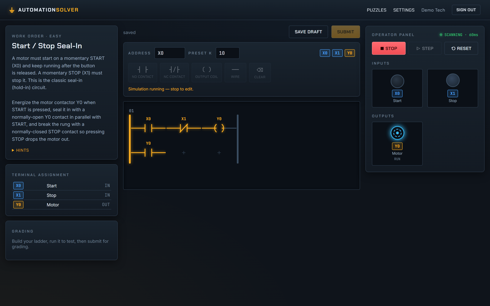

# AutomationSolver

A puzzle game where you program a **Mitsubishi-style PLC** in ladder logic to solve
real motor-control problems — start/stop seal-ins, emergency stops, on-delay timers,
counters, and a conveyor index. Build a rung on the grid editor, hit **Run**, and watch
the power flow light up your machine. Submit and the server grades your solution against
scripted test scenarios.



## Stack

- **Frontend** — React + TypeScript (Vite), TanStack Query, Zustand, React Router.
- **Backend** — Express + Passport (local + Google/GitHub OAuth), sessions.
- **Database** — SQLite via Node's built-in **`node:sqlite`** (no native build step).
- **Shared** — a pure-TypeScript ladder-logic **simulation engine** used by both the
  client (live play) and the server (authoritative grading), so they always agree.

> No native modules. Password hashing uses `node:crypto` scrypt and the database uses
> the built-in `node:sqlite`, so `npm install` never needs a C++ toolchain.

## Layout

```
packages/
  shared/   ladder model, scan-cycle engine, puzzle schema, processes, grader (+ tests)
  server/   Express API, auth, node:sqlite data layer, grading endpoint (+ supertest)
  client/   Vite React SPA: grid ladder editor, live sim + HMI panel (+ Playwright e2e)
```

## Getting started

```bash
npm install
npm run dev        # server on :4000, client on :5173 (Vite proxies /api → :4000)
```

Open http://localhost:5173. Create an account (email + password) and start solving.

### OAuth (optional)

Copy `packages/server/.env.example` to your environment and set
`GOOGLE_CLIENT_ID`/`GOOGLE_CLIENT_SECRET` and/or `GITHUB_CLIENT_ID`/`GITHUB_CLIENT_SECRET`.
Providers with blank credentials are simply hidden on the sign-in page.

- Google callback: `http://localhost:4000/api/auth/google/callback`
- GitHub callback: `http://localhost:4000/api/auth/github/callback`

## Tests

```bash
npm test                       # shared engine (vitest) + server API (supertest)
npm run test:shared            # just the simulation-engine unit tests
npm run test:e2e -w @automationsolver/client   # Playwright: build + solve a puzzle end-to-end
npm run typecheck              # tsc across all packages
```

The engine tests cover rung power-flow (series/parallel/NC/edge), timers, counters, and
prove that a canonical solution exists for **every** shipped puzzle.

## How the simulation works

A program is a list of **rungs**; each rung is a grid of cells. Contacts and wires are
horizontal conducting edges; vertical links join rows into parallel branches. Each scan,
the [`rungSolver`](packages/shared/src/sim/rungSolver.ts) treats the grid as a graph and
floods power from the left rail — series = AND, parallel = OR. The
[`SimEngine`](packages/shared/src/sim/scanCycle.ts) advances only by an explicit `dt`, so
the client animation and the server grader produce identical traces.

## Adding a puzzle

Add a `PuzzleSpec` under [`packages/shared/src/puzzle/content/`](packages/shared/src/puzzle/content)
and register it in `content/index.ts`. A puzzle declares its I/O devices, allowed
instructions, a process model (`passthrough` or a stateful one like `conveyor`), and
graded **scenarios** (scripted input timelines with expected outputs). Add a canonical
solution to `grade.test.ts` to prove it's solvable.

## Roadmap

The `shared/puzzle` process-model abstraction is designed to host a second puzzle family —
**control-cabinet wiring** (contactors, overloads, AC motor control) — without reworking
the engine or API.
