# ⚡ AutomationSolver

**A puzzle game where the puzzle piece is ladder logic.** Program a Mitsubishi-style PLC on a grid editor, hit Run, and watch power flood the rung while a real machine moves in 3D beside it. Fifty-three work orders across twelve categories take you from a single contact driving a single coil to a PID loop holding a tank on setpoint, and on to a whole excavator plant written in seven program sections, where the job is no longer to make a machine work but to find out which of six stations is holding the line up.

[]()
[]()
[]()

[**Play the demo rung →**](https://cuplexuser.github.io/AutomationSolver/) · a real solver and grader running in the page, no install

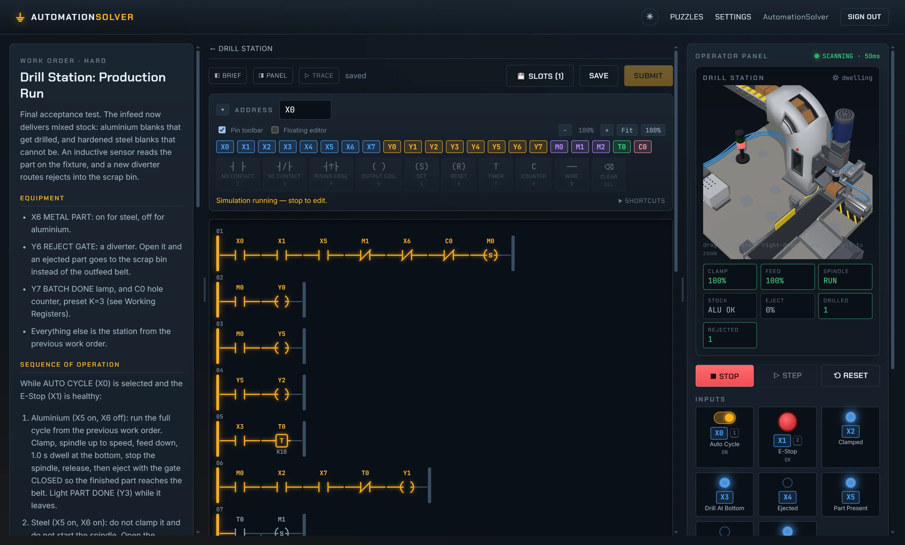

## The bench

Three columns, all live at once.

- **Work order** — the brief reads like a machine manual: equipment list, sequence of operation, interlocks, acceptance criteria. Terminal assignments light up as the sim runs, and progressive hints are there when you want them.
- **Ladder editor** — a grid of cells you fill with contacts, coils, timers, counters and function blocks. Series is AND, vertical links are OR. Keyboard-first (one letter per instruction), zoomable, with in-place editing of any address, preset or operand.
- **Operator panel** — push buttons, maintained switches, e-stops, lamps, motors and analog trends bound to real X/Y addresses. Hold digit keys **1–9** to press several buttons at once, which the two-hand safety press genuinely requires.

Press **Run** and the rung lights up cell by cell as power floods it from the left rail. Press **Submit** and the server replays your program through scripted test scenarios, with machine dynamics, and scores it.

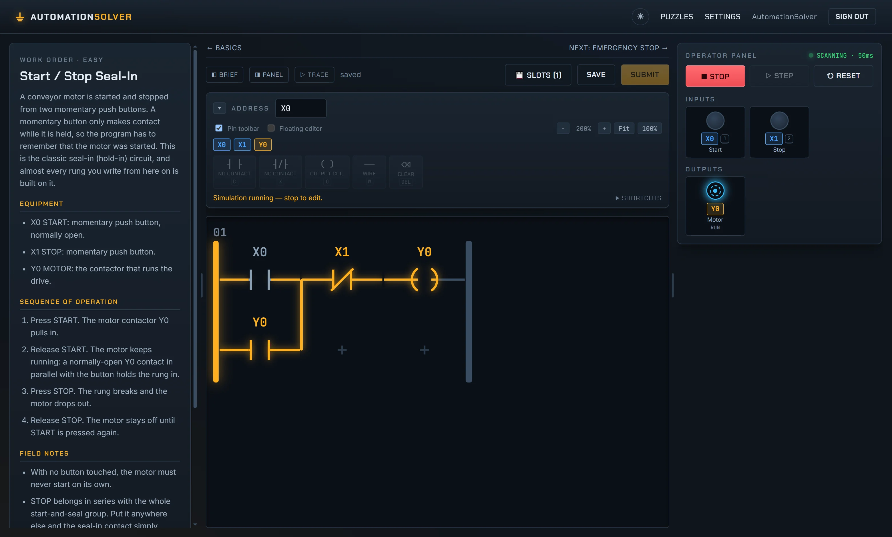

*Work order 02. The motor is running with nothing held down: the parallel `Y0` contact under the start button is sealing the rung in, and you can see exactly which cells are carrying power.*

## The machines

Every puzzle family drives a machine visualization that is a diagnostic instrument rather than decoration: nothing animates on its own, and every transform is a pure function of the deterministic state the process model computed from `dt`. Five scenes are hero models authored in Blender and loaded as glTF; two are procedural, because their subject is a number moving, or a grid of stock, and a shape that *is* that number reads better than geometry would.

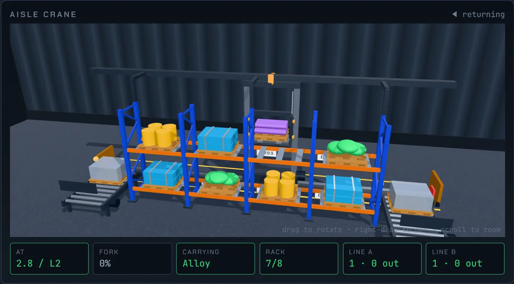

*The newest category and the hardest. Eight rack slots wearing the WMS register names the program reads (`D101`..`D204`), a twin-mast crane carrying the load between its columns on a three-stage telescopic fork, and two production lines calling for material at either end of the aisle. Each material has its own load shape as well as its own color, so a mis-delivery is visible before the grader says so.*

| | |
|---|---|
| 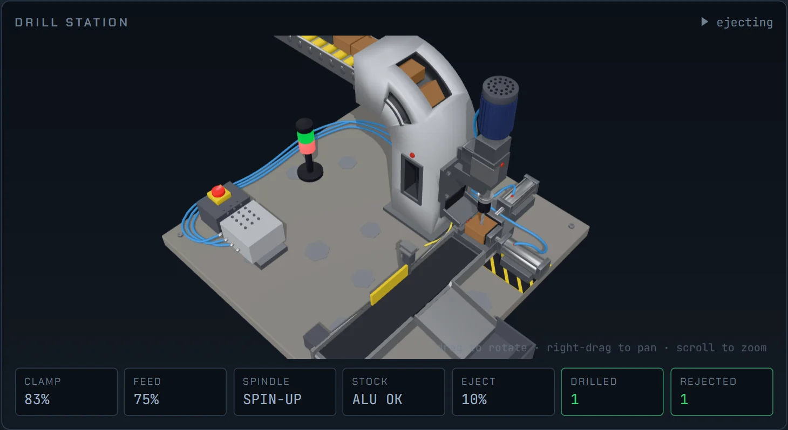<br>**Drill Station** · clamp, spindle spin-up, feed and eject, sorting aluminum from hardened steel through a reject gate | 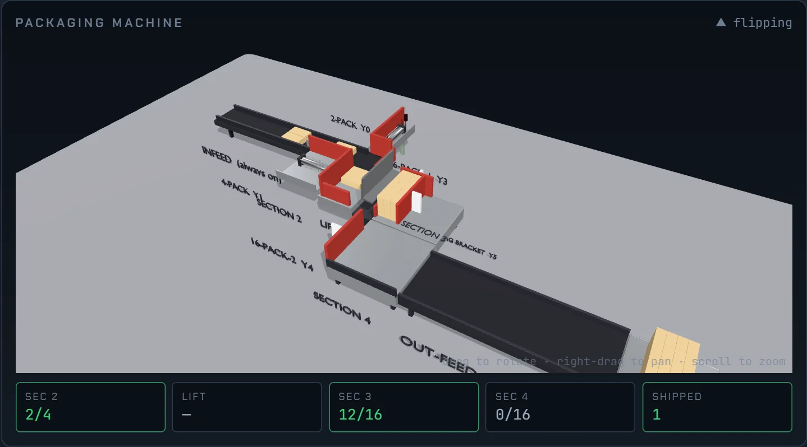<br>**Packaging Machine** · six pneumatic actuators group boxes 2 → 4 → 16, with a lift that flips cartons on end |
| 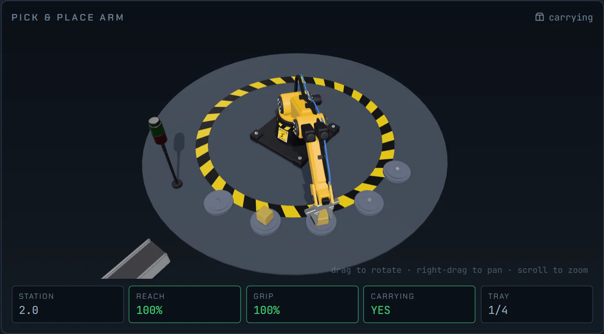<br>**Pick & Place** · a two-link arm swings between infeed and tray, reaching on an IK path so the gripper hangs plumb | 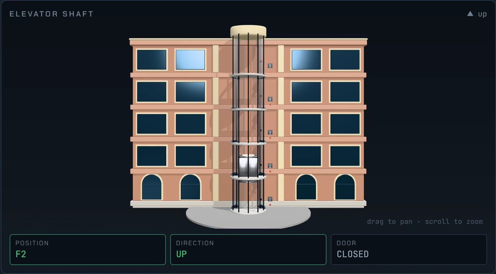<br>**Elevator** · five floors, call buttons, and doors the car physically will not move against |
| 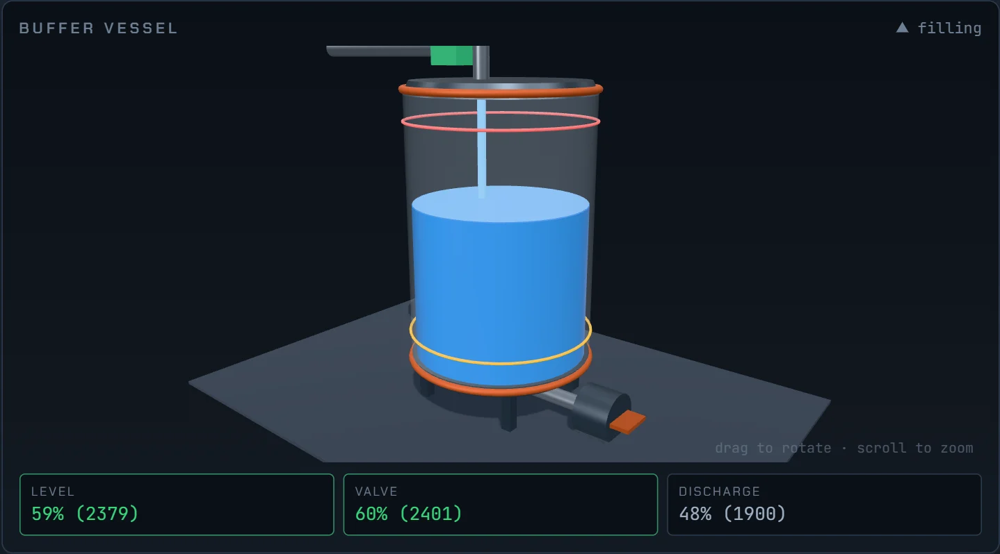<br>**Process Control** · the liquid column *is* the register, the inlet stream's radius *is* the valve opening | 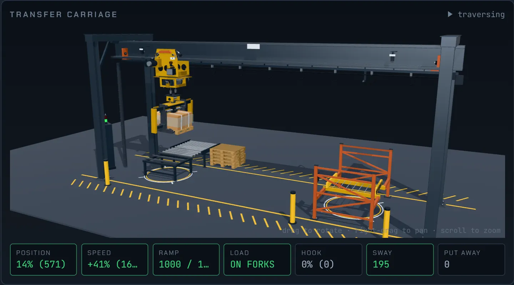<br>**Motion Control** · a VFD gantry on ramp parameters, with a pallet swinging on the hoist after the trolley stops |

## Two ways to program

### Ladder logic

Mitsubishi FX addressing: `X` inputs, `Y` outputs, `M` relays, `T` timers, `C` counters, and `D` data registers.

- **Bit instructions** — normally-open and normally-closed contacts, rising- and falling-edge contacts, OUT / SET / RST coils, timers (presets in 100 ms units) and counters.
- **Word instructions** — `compare` (a conducting contact carrying `= <> > < >= <=`), `MOV`, `ADD`/`SUB`/`MUL`/`DIV`, and a real `PID` block with gain, integral and derivative times, its own sample period, an output clamp and conditional anti-windup integration.
- **Analog I/O** — transmitters report **raw counts** (0..4000, the FX analog cards these puzzles model), never pre-scaled engineering units. Scaling them is the first analog puzzle's lesson, not something the plant does as a favor. Registers are 16-bit signed and **saturate rather than wrap**, and arithmetic evaluates at full precision before saturating on the store, so "divide before you multiply" is a lesson the puzzles teach.

### Control cabinet wiring

The second genre drops ladder logic entirely: you wire the terminals of fixed components — a 3-phase supply, contactors, a thermal overload, pushbuttons, lamps and a motor — using IEC terminal numbering (`K1.A1`, `F1.96`). Two editable views of the same document:

| 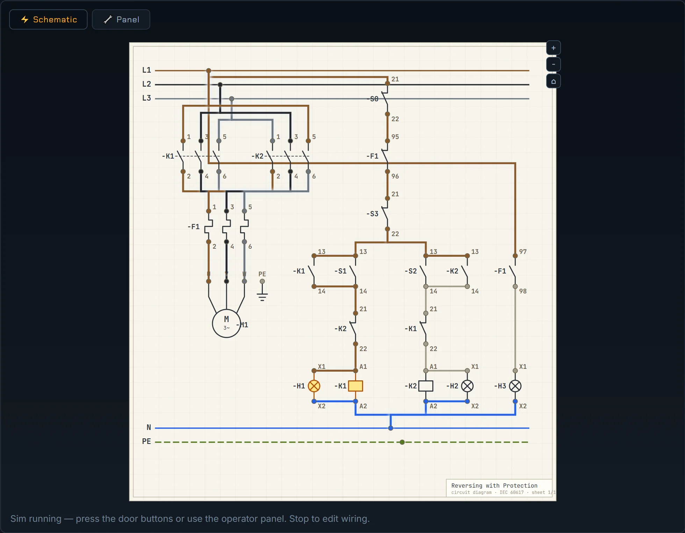 | 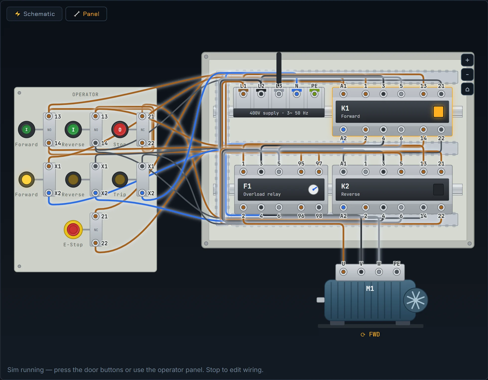 |
|---|---|
| **Schematic** — an IEC circuit diagram on white drawing paper, components broken into their distributed parts with `-K1` cross-references and Manhattan wire routing. | **Panel** — an illustrated enclosure with DIN rails, slotted wire ducts, a door strip of real operators and a finned motor. Wires route orthogonally through the ducts. |

Wires and terminals color by live net potential (L1 brown, L2 black, L3 grey, N blue, PE green-yellow). Merge two supply potentials onto one net and the breaker trips, exactly as it would in the panel.

## Grading, replay and the trace strip

Submitting runs every scenario the puzzle declares: a scripted input timeline with assertions, driven through the same simulation engine and the same process model the client just used.

- **Sequencing puzzles** are paced by the program driving them, so a step can run to a **milestone** (`until`) rather than a fixed deadline. Grading pace instead of behavior is how you fail a correct program for being 200 ms slow.
- **Regulating puzzles** get a different question: a step carries a setpoint, a band, a settle time and overshoot and steady-error caps, evaluated across the whole step. A loop that happens to be sitting on setpoint when the clock runs out has not been shown to work, and one that got there through a 40% overshoot would have put product on the floor.
- **Scoring** is 85 marks for scenarios passed plus 15 for performance, and the performance marks only land once everything passes. Sequencing puzzles spend them on cycle time against a declared par; regulating puzzles spend them on integral of absolute error. A correct but leisurely program is solved and unlocks what follows, and still has to be pipelined to reach 100.
- **Replay** — every failing scenario gets a ▶ button that re-runs it scan by scan, right in the editor, with a scrubber. Jump straight to the first failing scan and watch the rung that did it.
- **Trace strip** — a logic-analyzer view, one row per device or register, filled where the bit is high. It reads the live sim's rolling window or the replay's full trace, and word devices draw as strip charts, because a regulator cannot be judged from an instantaneous number.

## The work orders

| Category | What it teaches |
|---|---|
| **Basics** (3) | Contacts, coils and seal-in logic. |
| **Timers & Counters** (4) | On-delay, off-delay, oscillators and counting. |
| **Stations** (2) | Sequenced single-station machines: a conveyor index and a two-hand safety press. |
| **Elevator** (4) | Multi-floor dispatch, up/down latches with tie-break, and door interlocks enforced physically. |
| **Control Cabinet** (6) | Wire real 400 V starters terminal to terminal: DOL, two-station control, reversing, indication. |
| **Packaging Machine** (4) | Group boxes 2 → 4 → 16 with pushers, a flipping lift, a retaining bracket and an out-feed. |
| **Pick & Place** (4) | Index a robot arm between an infeed and a tray, one part at a time, without overfilling. |
| **Drill Station** (4) | Clamp, spin up, drill and sort mixed stock through one automatic station. |
| **Process Control** (5) | Scale a transmitter, build a P regulator by hand out of SUB/MUL/ADD, then let a PID block kill the offset. |
| **Motion Control** (4) | Speed references, drive ramp parameters, and the stopping distance a loaded carriage implies. |
| **Automated Warehouse** (6) | Drive a stacker crane by position sensor, search a WMS table for the nearest slot holding what was asked for, and keep two lines fed from one aisle. |
| **Excavator Plant** (7) | Not a machine but a **line**, written in seven program sections across one 55 x 38 m floor: a weld fixture, a rack store, a portal robot, a spray booth and cure oven, a jig, a test bay and dock, and twelve zones of accumulating conveyor the player programs. Ends in a capstone that hands over every section already working and asks you to make it earn more. |

Categories unlock sequentially — each one's first puzzle is always open, and the rest gate on the previous solve. Enforced on the API, not just hidden in the UI.

## One engine, both sides

The architectural bet of the whole project: **a single pure-TypeScript simulation engine in `packages/shared` runs on both the client and the server.** The client runs it for live play; the server runs the identical code as the source of truth for scoring. There is no second implementation to drift — including on the landing page, whose playable rung compiles the same engine into itself rather than imitating it.

```
             packages/shared  (no runtime deps)
             ├── ladder/      program model + address parsing
             ├── circuit/     cabinet components, net solver, wiring grader
             ├── sim/         rungSolver + SimEngine scan cycle
             └── puzzle/      spec schema, process models, validator, grader
                    │                      │                      │
        imported by │          imported by │          imported by │
                    ▼                      ▼                      ▼
            packages/client        packages/server           site/
            (Vite React)           (Express)                 (Vite)
            live sim, editor,      authoritative             the landing page's
            HMI panel              grading, auth, DB         playable rung
```

They agree bit-for-bit because of two rules the codebase enforces rather than documents:

- **The engine advances only by an explicit `dt`, never wall-clock time.** `npm run lint` bans `Date`, `performance`, `Math.random`, `window` and `document` inside `packages/shared`. If the engine could read the clock, client and server would stop agreeing.
- **The client's live scan `dt` *is* the grading `dt`** (50 ms, one shared constant). Boolean puzzles tolerated a mismatch because every process model's timings were exact multiples of both; an integrator does not. Continuous plants integrate on a fixed 10 ms sub-step with a carried remainder on top of that, so a trajectory is identical at any `dt`.

`rungSolver.ts` treats a rung as a graph and floods power from the left rail using disjoint-set union over column-boundary nodes. `scanCycle.ts` evaluates rungs top to bottom and applies coils immediately, so a later rung sees an earlier rung's coil in the *same* scan, and snapshots the previous-bit image at the **end** of each scan, which is what makes edge contacts work.

## Getting started

```bash
git clone https://github.com/CuplexUser/AutomationSolver.git
cd AutomationSolver
npm install
npm run dev        # server on :4000, client on :5173 (Vite proxies /api → :4000)
```

Open <http://localhost:5173>, create an account, and start solving.

Google and GitHub sign-in are optional: copy `packages/server/.env.example`, set `GOOGLE_CLIENT_ID`/`GOOGLE_CLIENT_SECRET` and/or `GITHUB_CLIENT_ID`/`GITHUB_CLIENT_SECRET`, and providers left blank are simply hidden on the sign-in page.

- Google callback: `http://localhost:4000/api/auth/google/callback`
- GitHub callback: `http://localhost:4000/api/auth/github/callback`

With SMTP unconfigured, verification and password-reset emails are written to the server console instead of being sent.

## Zero native dependencies

`npm install` must work on a fresh machine with nothing but Node — no C++ toolchain, no node-gyp, no prebuild roulette. Nothing in this repo compiles native code, and the substitutions are deliberate:

| Instead of | This project uses |
|---|---|
| better-sqlite3 / sqlite3 | Node's builtin `node:sqlite` (`DatabaseSync`) |
| argon2 / bcrypt | `node:crypto` scrypt, stored as `scrypt$salt$hash` |
| connect-sqlite3 | a custom session store on `node:sqlite` |

## Project layout

```
packages/
  shared/   ladder model, circuit solver, scan-cycle engine, puzzle specs,
            process models, validator, grader  (no runtime deps)
  server/   Express + Passport, node:sqlite data layer, submit + grading API
  client/   Vite React SPA: ladder editor, cabinet editor, live sim, 3D machines
docs/       reference only: FEATURE-MAP.md (what exists and why), VARIABLES-AND-POUS.md,
            FACTORY.md + FACTORY-LINE-DESIGN.md (the plant), ROADMAP.md (the history)
TODO.md     the one work list, prioritized
site/       the GitHub Pages landing page: a small Vite app whose playable
            rung imports the shared engine, built by `npm run build:pages`
```

The database stores puzzle references by `slug` only; puzzle content is never duplicated into it. A player can keep several named save slots per puzzle, and submitting saves into whichever one is active, so a submission never loses work.

## Tests

```bash
npm test                       # shared engine (vitest) + server API (supertest)
npm run test:shared            # just the simulation-engine unit tests
npm run typecheck              # tsc --noEmit across all packages
npm run lint                   # oxlint repo-wide + ESLint react-hooks on the client
npm run test:e2e -w @automationsolver/client   # Playwright: build and solve a puzzle
```

The engine tests cover rung power flow (series, parallel, NC, edge), timers, counters, register saturation and PID behavior. Two of them are the load-bearing ones: `grade.test.ts` and `gradeCabinet.test.ts` hold a canonical solution for **every shipped puzzle**, which is the guardrail against authoring a puzzle nobody can solve.

## Adding a puzzle

Add a `PuzzleSpec` under [`packages/shared/src/puzzle/content/`](packages/shared/src/puzzle/content), register it in `content/index.ts`, and add a canonical solution to `grade.test.ts`. A spec declares its I/O devices, optional working registers, allowed instructions, a process model (`passthrough`, or a stateful one like `drill` or `tank`) and graded scenarios.

Process models are small deterministic state machines that react to `Y` outputs and drive `X` inputs. They grow by feature detection off the puzzle's own device list, so one model serves a whole category and an early puzzle never fails an interlock it cannot see.

Write the briefing as an instruction manual rather than prose: a short lead paragraph, then `## Section` blocks (`Equipment`, `Sequence of operation`, `Interlocks and safety`, `Field notes`, `Acceptance`).

## What's next, and where it's written down

[**`TODO.md`**](TODO.md) is the only work list — a prioritized checklist, and the single point of interest for developing anything new. Top of it right now is finishing **variables and POUs**: the symbol table, the allocator, the resolver and the validation rules are all built and tested, and the declaration pane that would let a player actually create a local or a global is a finished component that nothing mounts yet.

Everything under `docs/` is *reference* rather than a queue. If a piece of work is not a checkbox in `TODO.md`, it is not scheduled, whatever a design document's closing paragraph might imply.

- [`docs/FEATURE-MAP.md`](docs/FEATURE-MAP.md) — where every capability lives and why it is built that way
- [`docs/VARIABLES-AND-POUS.md`](docs/VARIABLES-AND-POUS.md) — the symbol table, scopes, and player-authored POUs
- [`docs/FACTORY.md`](docs/FACTORY.md) — the excavator plant: its vision, its two process models, and what each puzzle settled
- [`docs/FACTORY-LINE-DESIGN.md`](docs/FACTORY-LINE-DESIGN.md) — the line's floor plan, its zoned spine, and every timing measured rather than estimated
- [`docs/ROADMAP.md`](docs/ROADMAP.md) — the historical record of how the phases landed. Not a queue.

## License

See [LICENSE](LICENSE).
