# The Excavator Line: Plant Design

The locked design for the `factory-line` plant, its floor, its transport and its cameras.
[FACTORY.md](./FACTORY.md) is the category's story and progress; this is the specification the
implementation follows, and it exists so the plant is settled **before** a single station program
is written against it. Anything here that changes after puzzle 48 ships is a change that
invalidates rungs somebody already wrote.

Three decisions were taken deliberately and everything below follows from them:

1. **The conveyor is fully zoned and the player programs it.** Not scenery, not a few stoppers.
2. **The six sections are built out at honest scale.** 55 x 38 m, real aisles, real cells.
3. **All six stations are retimed** so the bottleneck moves depending on what the player does.

The first of those has a consequence worth stating plainly: the spine is a **seventh program
section**, `CONV`. Transport stops being the thing between the stations and becomes a station.
That is what makes the category's stated vision ("make transport the program") literal rather
than aspirational, and it is what finally gives the store and the paint shop a lever, because a
line whose transport is free is a line where only the slowest machine matters.

---

## 1. Scope of the change

| | Now | After |
|---|---|---|
| Floor | 32 x 23 m, U-shaped | 55 x 38 m, S-shaped with a centre aisle |
| Sections | 6 (SUP WELD STORE PAINT ASSY TEST) | **7** (+ CONV) |
| Transport between stations | parts teleport; buffers are static stands | one continuous zoned conveyor, drawn end to end |
| I/O | 32 in / 28 out / 18 reg | **47 in / 42 out / 22 reg** |
| Cameras | 4 presets, all high three-quarter | **8 presets**, low and varied, plus one overview |
| Scene detail | bays on a slab | fenced cells, striping, floor markings, services, HMI, people |

The tutorial plant (`factory`, puzzle 47) and its scene are **not touched**. That plant exists to
be the simple one, and the argument for splitting the two models applies with more force to the
scene than it did to the process: the whole point of the commissioning tutorial is that it is not
this.

---

## 2. Floor plan

One scene unit is one metre. The floor is `x ∈ [-28, 27]`, `z ∈ [-19, 19]`.

```
        x=-28                                                              x=+27
   z=-19 ┌──────────────────────────────────────────────────────────────────────┐
         │ ░░░ north wall: rack store lane heads, services, clerestory ░░░░░░░░░ │
   z=-18 │  ┌─────────────┐  ┌───────────────────┐  ┌─────────┐  ┌────────────┐  │
         │  │             │  │   RACK STORE      │  │  SPRAY  │  │ CURE OVEN  │  │
         │  │  WELD BAY   │  │   4 lanes x 2     │  │  BOOTH  │  │  2 racks   │  │
         │  │  fixture +  │  │  ╔══ PORTAL ══════╪══╪══╗      │  │            │  │
         │  │  positioner │  │  ║   ROBOT       ║  │  ║ skid │  │            │  │
   z=-6  │  └──────┬──────┘  └──╨────┬──────────╨──┘  └────┬────┘  └─────┬──────┘  │
         │         │  Z1  Z2  Z3     │                    │             │        │
   z=-5  │         ╘═════════════════╛                    └── internal ─┘        │
         │                                                            Z4 ╔═╗     │
   z=-4  ├──────────────── CENTRE AISLE  (walkway + services) ────────────╫─╫─────┤
   z= 0  ├────────────────────────────────────────────────────────────────╫─╫─────┤
         │                                                            Z5 ╚═╝     │
   z=+3  │  ┌──────────┐  ┌──────────┐  ┌────────┐  ┌──────────────────┐ Z6 ║     │
         │  │          │  │   DOCK   │  │  TEST  │  │  FINAL ASSEMBLY  │◀──Z7 sort│
         │  │  YARD    │  │  apron + │  │  BAY   │  │  jig + make-up   │ Z8 frame │
         │  │  6 bays  │  │  haulier │  │        │  │  bench           │ Z9 boom  │
         │  │          │  │          │  │        │  │                  │          │
   z=+15 │  └──────────┘  └────┬─────┘  └───┬────┘  └────────┬─────────┘          │
         │        Z12          │    Z11     │       Z10      │                    │
         │         ╘═══════════╛════════════╛════════════════╛                    │
   z=+19 └──────────────────────────────────────────────────────────────────────┘
```

### Cell footprints and anchors

Footprints are fixed. **A cell may be re-modelled inside its box without moving anything else**,
which is the forward-compatibility rule that lets procedural geometry be swapped for a Blender
GLB later, one cell at a time.

| Cell | Footprint `x`, `z` | Infeed anchor | Outfeed anchor |
|---|---|---|---|
| WELD | `[-27,-15] × [-18,-6]` | blank rack `(-25,-12)` | fixture roll-off `(-15,-5)` |
| Spine A | `z=-5`, `x ∈ [-15,-6]` | `(-15,-5)` | `(-6,-5)` |
| RACK STORE | `[-13,1] × [-18,-6]` | loader `(-6,-5)` | pick face `(-4,-8)` |
| PORTAL | rail `z=-8`, `x ∈ [-4,7]`, beam `y=5.0` | store pick `(-4,-8)` | booth skid `(6,-8)` |
| SPRAY BOOTH | `[3,12] × [-18,-6]` | skid `(6,-8)` | to oven `(12,-10)` |
| CURE OVEN | `[14,24] × [-18,-6]` | `(14,-10)` | discharge `(24,-8)` |
| Spine B (east) | `x=26`, `z ∈ [-8,3]` | `(26,-8)` | sort `(26,3)` |
| Spine C (lanes) | frame `z=5`, boom `z=7.5`, `x ∈ [13,26]` | sort `(26,3)` | jig `(13,5)` / `(13,7.5)` |
| FINAL ASSEMBLY | `[7,24] × [3,15]` | jig `(13,6)` | release `(7,11)` |
| Spine D | `z=11`, `x ∈ [-8,7]` | `(7,11)` | `(-8,11)` |
| TEST BAY | `[-6,4] × [3,15]` | `(4,11)` | `(-6,11)` |
| DOCK | `[-17,-8] × [3,15]` | `(-8,11)` | truck bay `(-14,13)` |
| YARD | `[-27,-19] × [3,15]` | `(-19,11)` | 6 bays, 3 x 2 |

Row A is 12 + 14 + 9 + 10 m of cell with 2 m gaps; row B is 8 + 9 + 10 + 17. Both come to 55 m
across, which is where the floor width comes from rather than the other way round. Zone lengths
in §3 are nominal: on a real accumulating conveyor a zone is as long as the part it carries, and
the boundaries here fall at the station handshakes.

### Why an S and not a straight line

55 m of straight line frames badly at any camera angle that also shows detail, and no real plant
builds one either. The S puts the two halves of the line either side of a walkway, which is what
makes the **centre aisle** the single most useful camera position in the building: standing in it,
you can see the weld bay behind you and final assembly in front of you, which is exactly the
comparison the category is trying to teach.

---

## 3. The zoned conveyor

### The lesson

Zero-pressure accumulation. Each zone carries one photo-eye and one drive.

**As built, the rule is stated from the receiving end**, which is the one thing about a zoned
conveyor worth getting right: *a zone's drive runs that zone's own belt, and a part only enters a
zone while that zone is running and clear.* A program does not push parts along the spine, it
decides which stretches of belt are turning, and parts fall through the ones that are.

Two consequences make it a puzzle rather than a formality:

- **Nothing faults.** A drive called with a full zone in front turns under a part that is going
  nowhere. The cost of getting it wrong is seconds, not a crash.
- **You cannot pick a part off a moving belt.** A station lifting from a zone (the store's loader,
  the jig calling a lane, the test bay taking a machine) needs that zone *stopped*. Without this,
  the answer to every zone is "run it all the time" and accumulation does the rest — a mechanism
  with no decision in it. With it, a zone has to be run to fill and stopped to empty, so the
  program has to know which of those it is doing.

Written well (`CONV_TUNED`) it is one rung per zone — *run this belt while this zone's eye is
clear* — and parts queue nose to tail. Written the way most people write it first (`CONV_PLAIN`),
a whole run is interlocked as one belt on the station at the end of it, so a part three zones back
with a clear road waits for a station it was never going to reach yet.

A queue also drains **one part at a time**: a part starts moving when the space in front of it
appears, not when the belt starts, so a queue of three costs three zone-times to clear. That is
enforced by resolving transfers downstream-first, and it is pinned by a unit test.

> **Measured, and still not true.** The conveyor's lever is **zero**: swapping `CONV_TUNED` for
> `CONV_PLAIN` costs the shift nothing at all. The first diagnosis — that the spine never has a
> queue on it — has since been fixed and was not the whole answer. The line now pipelines and the
> spine carries three parts on average and eight at its peak, and the two programs *still* ship the
> same 37 machines. The remaining reason is that a plain spine blocks the weld bay and the oven
> discharge, and neither of those is what sets the plant's pace. See §5a.

That is intended to be the largest single lever in the design, and it is the one that makes a
backed-up line **visible**: when the booth stops, you watch the queue grow backwards down the spine toward the
weld bay, one zone at a time, until the weld bay itself is blocked. No other mechanism in the
game shows a player where the constraint is as directly as that.

### Zone map

```mermaid
flowchart LR
  WELD[WELD<br/>fixture] --> Z1
  Z1[Z1<br/>weld outfeed] --> Z2[Z2<br/>transfer] --> Z3[Z3<br/>store infeed]
  Z3 --> STORE[RACK STORE<br/>4 lanes x 2]
  STORE -.portal robot.-> BOOTH[SPRAY BOOTH]
  BOOTH --> OVEN[CURE OVEN]
  OVEN --> Z4[Z4<br/>oven discharge]
  Z4 --> Z5[Z5<br/>east transfer] --> Z6[Z6<br/>east transfer] --> Z7{Z7<br/>SORT}
  Z7 -->|frame| Z8[Z8<br/>frame lane]
  Z7 -->|boom| Z9[Z9<br/>boom lane]
  Z8 --> ASSY[FINAL ASSEMBLY<br/>jig + bench]
  Z9 --> ASSY
  ASSY --> Z10[Z10<br/>assy outfeed] --> Z11[Z11<br/>test infeed]
  Z11 --> TEST[TEST BAY]
  TEST --> Z12[Z12<br/>dock apron] --> DOCK[DOCK<br/>haulier]
```



Twelve zones. The portal robot stays as the store-to-booth link rather than becoming conveyor:
it is already a lesson (a gantry that cannot travel with its head down), and replacing it with
rollers would delete that lesson to duplicate a different one.

### Device map for `CONV`

| Zone | Eye (part present) | Drive | Length |
|---|---|---|---|
| Z1 weld outfeed | `X32` | `Y28` | 3 m |
| Z2 transfer | `X33` | `Y29` | 4 m |
| Z3 store infeed | `X34` | `Y30` | 3 m |
| Z4 oven discharge | `X35` | `Y31` | 3 m |
| Z5 east transfer N | `X36` | `Y32` | 4 m |
| Z6 east transfer S | `X37` | `Y33` | 4 m |
| Z7 sort | `X38` | `Y34` | 3 m |
| Z8 frame lane | `X39` | `Y35` | 6 m (3 parts) |
| Z9 boom lane | `X40` | `Y36` | 6 m (3 parts) |
| Z10 assy outfeed | `X41` | `Y37` | 4 m |
| Z11 test infeed | `X42` | `Y38` | 3 m |
| Z12 test outfeed → dock | `X43` | `Y39` | 5 m |

Plus, at the sort:

| Address | Meaning |
|---|---|
| `X44` | Boom at sort (type read, exactly as `X12` reads the store infeed) |
| `X45` | Frame lane full |
| `X46` | Boom lane full |
| `Y40` | Divert to frame lane |
| `Y41` | Divert to boom lane |
| `D18` | Parts standing on the spine |
| `D19` | Zone the spine is blocked at, 0 when it is flowing |

**As built**, three of the twelve zones already existed under their own names and kept them, because
they are the same rollers: Z3 is the store's infeed (`storeIn`), and Z8/Z9 are the two painted lanes
(`laneF`, `laneB`). Every station that read them goes on reading them. Two more notes:

- `D19` reports the **furthest-downstream** blocked zone, not the furthest upstream. The front of a
  queue is the zone sitting against whatever stopped, so the number names the station holding the
  line up; the back of the queue only says how long it has been going on.
- The sort's paddle needs the lane it pushes into to be *turning* to take the part, so a divert is
  two coils (`Y40`+`Y35`, or `Y41`+`Y36`) and not one — while the jig needs that same lane
  *stopped* to lift a part off it. That conflict is the sort's whole sequencing problem.

Added: **15 inputs (`X32`-`X46`), 14 outputs (`Y28`-`Y41`), 2 registers.** New totals 47 in /
42 out / 22 reg.

### Ownership

Superseded by [VARIABLES-AND-POUS.md](./VARIABLES-AND-POUS.md). The flat `LINE_OWNS` block per
section goes away for player code: working storage becomes **local variables** the player declares
and the allocator places, the spine's interface to the other six sections becomes **globals** it
publishes, and what the puzzle still fences is only which actuators the submission may drive
(`writableOutputs: ['Y28-Y41']` for the conveyor puzzle). Shipped fixture slots keep `owns`.

That change is what makes "the spine is reachable from every section" expressible at all, and it
is the reason the conveyor is a section rather than scenery.

### Transport timings

| Constant | Value | Note |
|---|---|---|
| `ZONE_TRANSFER_MS` | 500 | one zone advance, at line speed |
| `ZONE_ACCEPT_MS` | 250 | station handshake in or out of a zone |
| `SORT_DIVERT_MS` | 400 | paddle across |
| `SPINE_CAP` | 1 part per zone, 3 in each lane zone | |

The arithmetic below is the design's original case for the spine being the plant's largest lever,
and it is **the one claim in this document that measurement contradicts**. It is left here because
§5a's argument is only readable against it.

> Well written, the spine costs **0.6 s per part** of throughput (one zone-time, pipelined) = 1.2 s
> per machine. Badly written it costs a part's whole transit: Z1 to Z3 is 1.8 s and Z4 to the jig
> is 3.0 s, so a non-accumulating spine costs about **7.2 s per machine** and is comfortably the
> bottleneck. That gap, ~6 s a machine, is the biggest lever in the plant and it belongs to a
> program that is about twenty rungs long.

What that misses is that a badly written spine does not *slow* anything down, it *blocks* the
stations either side of it — and blocking only costs output when the station being blocked is the
one setting the pace. On this plant it never is.

---

## 4. Retimed stations

Target: every station within a second of the others, so the constraint genuinely moves. Current
spread is 4.4 s and the line is weld-paced; target spread is under 1 s.

| Station | Now | Target | Constants to change |
|---|---|---|---|
| WELD | 7.2 s | **6.0 s** | clamp 500→450, frame pass 1100→900 (x2), rotate 600→500, boom pass 1200→1000, release 400→350 |
| STORE + portal | ~6.4 s | **5.5 s** | portal travel 800→700, lift 300→250, grip 200→180; load/pick 800→700 |
| BOOTH | 2.8 s | **5.4 s** | blast 1200→1900, `FILM_RATE` 1000→300, purge 1200→1900 |
| OVEN | 5.2 s | **5.7 s** | `CURE_BASE_MS` 3000→3400 |
| ASSEMBLY | 6.4 s | **6.0 s** | engine 2200→2000, cab 1800→1700, pin 2400→2300 |
| TEST + dock | 5.2 s | **5.7 s** | pump 1200→1300, cycle 2600→2900, dispatch 1400→1500 |
| CONV | — | **1.2 s** tuned, 7.2 s plain | as above |

Two of these deserve a note.

**The booth doubles.** It is currently idle more than half the time, which is why the paint
puzzle's lever measures zero. Nearly all of the increase goes into the blast, not the spray,
because blast time is time the purge can hide inside — keeping `PURGE_MS == PAINT_BLAST_MS`
preserves the one property that made the flush free to overlap, which the tests pin.

**`FILM_RATE` drops to a third.** Spraying is currently 210 ms and therefore invisible; at 300 a
frame's 2100 counts take 700 ms and a boom's 1500 take 500. That is what turns the per-part film
recipe from a rounding error into a real second per machine, which is the paint shop's lesson.

**These are targets, not measurements, and they have been overtaken.** The spine changed the
arithmetic and so did the overlap pass; §5a records what the constants actually became and what the
plant actually does. Where this table and §5a disagree, §5a is right. `factoryLineTempo.test.ts` is
the instrument — it soaks a 300 s shift per configuration and is the only place any of these numbers
comes from.

---

## 5. Sections and puzzles

Seven sections, and the puzzle plan grows by one.

The seven section slots, their briefs and the scan order live in
`content/factory-line-sections.ts`, and a puzzle says which one it is opening. Six copies of seven
section briefs is how the player ends up commissioning a slightly different factory depending on
which puzzle they have reached.

| # | Slug | Opens | The lesson | The lever |
|---|---|---|---|---|
| 48 | ~~`factory-weld`~~ **shipped** | WELD | sequence a fixture with a positioner; alternate the mix; live with a consumable | one seam schedule per part, not one for both |
| 49 | ~~`factory-conveyor`~~ **shipped** | **CONV** | zero-pressure accumulation; divert by type; read a line that is backing up | none, measured. Graded on correctness; see the note below |
| 50 | ~~`factory-handling`~~ **shipped** | STORE | sort a rack by type; drive a portal robot; decouple two neighbours | none as throughput. Sorting is what makes the mix *recoverable*; see below |
| 51 | ~~`factory-paint`~~ **shipped** | PAINT | hold an analog band; spray to a spec; batch a changeover | a film recipe per part, worth 8 s over six machines |
| 52 | ~~`factory-assembly`~~ **shipped** | ASSY + TEST | interlock a build; take a calculated risk on supply; run a dock | the bench beside the jig (12 s over six machines) and a lorry sent for early (5.7 s over four) |
| 53 | ~~`factory-line`~~ **shipped** | all seven, seeded plain | the plant is the puzzle | 112.7 s for twelve machines against 170.3 s as handed over |

`CONV` comes second on purpose. It is the section every later puzzle depends on being able to
read: once a player has watched a queue grow backwards down the spine, "which station is holding
the line up" stops being a phrase in a briefing and becomes something they can see.

### What puzzle 48 settled about how these are graded

Worth recording, because each of the five after it wanted to make the same mistake:

- **The lever is scored, not graded.** `WELD_PLAIN` solves puzzle 48 and scores 88 against the
  canonical 100, which is the category's stated bargain in FACTORY.md and is what the three
  calibrated `parMs` targets are for. Two of the three sit past `PAR_SLACK` for the plain program,
  so the gap is felt without any scenario having to call a slow bay a fault.
- **Ask the plant what it actually charges for.** The first draft graded a boom's second pass as a
  tip-life defect and the assertion passed for both programs: `stepWeld` only advances `tipPasses`
  for a pass that *lays metal*, and a boom is `done` after its first, so the extra arc costs time
  and nothing else. The briefing had to be corrected, not the assertion. Measure the two programs
  against the scenario before writing a word of the Acceptance block.
- **Milestones, and one exact number.** Every step waits on `until` rather than a deadline, and the
  one hard equality in the puzzle is `tipPasses` after two parts (2 for the frame, 3 including the
  boom). That is what pins the *mix*, which is the thing a wrong weld bay actually breaks.

---

## 6. Cameras

The reference this is drawn from does one thing our current presets do not: it puts the camera
**inside** the cell, low, and pointing a different way each time. Our four presets all sit at
about 26 degrees elevation facing roughly +z, so cutting between them reads as a slideshow of the
same photograph. The fix is not a new camera system — `SectionCamera`'s viewport-derived distance
is right and stays — but a richer preset and real variety in what the presets say.

### `Focus` gains three fields

```ts
export interface Focus {
  center: [number, number, number];
  halfWidth: number;
  halfHeight: number;
  dir: [number, number, number];
  /** Clamp so a close shot stays close on a wide panel. */
  maxDistance?: number;
  /** Floor of the eye height, so a low preset never sinks into the slab. */
  minEyeY?: number;
  /** Roll-free framing: what the shot is *about*, for the caption strip. */
  label?: string;
}
```

`dir` stays a direction and the distance stays derived, so the presets keep working on a
resizable panel. `maxDistance` is what stops a wide viewport from silently turning a designed
close-up back into the overview shot we already have.

### The eight presets

| Preset | Looks at | Azimuth | Elev | The shot |
|---|---|---|---|---|
| **Overview** | plant centre `(0, 3, -2)` | 210° | 34° | High three-quarter down the length of the line. The only high shot. |
| **Weld** | fixture `(-21, 1.6, -12)` | 145° | 14° | Low, through the weld screens, arc toward camera. |
| **Conveyor** | sort `(26, 1.2, 3)` | 250° | 20° | Down the spine foreshortened, so a queue reads as a queue. |
| **Store** | rack wall `(-6, 2.4, -14)` | 100° | 18° | Square onto the lettered lane heads, C1..C4 legible. |
| **Portal** | portal head `(1, 3.4, -8)` | 190° | 8° | Very low, under the gantry beam, head crossing the frame. |
| **Paint** | booth mouth `(7.5, 1.8, -8)` | 300° | 16° | Past the drum bank into the booth, drums in the near field. |
| **Assembly** | jig `(16, 1.6, 6)` | 20° | 12° | Low across the jig with the make-up bench beside it. |
| **Dock** | apron `(-11, 1.5, 10)` | 340° | 22° | Over the yard toward the dock, truck bay centred. |

Three rules make these read the way the reference does:

1. **Eye height 1.4 to 3.4 m** for every preset but the overview. A camera at human height makes
   a 4 m machine feel like a 4 m machine; a camera at 20 m makes it a diagram.
2. **Something in the near field.** Fence mesh, a conveyor rail, the drum bank. Depth in a scene
   with no atmospherics comes from occlusion, and a preset framed on nothing but its own machine
   looks like a product render.
3. **No two adjacent presets share a facing.** The azimuths above are spread deliberately around
   the compass so that flying between sections feels like walking through a building.

### Overview stays orbitable

The plant view keeps its `OrbitControls` and its pan bounds, widened to the new floor:
`x [-27, 26], y [-1, 12], z [-18, 18]`, `maxDistance` 110. `shadowExtent` goes from 22 to 38, or
the far half of the plant loses its shadows at a line.

---

## 7. Scene vocabulary

The reference's readability comes from a small vocabulary applied everywhere, not from any one
model being detailed. In priority order:

**Colour language.** Orange (`#e8621a`) is anything that moves under power: the portal, the
diverter paddles, robot arms, lift masts. Blue-grey (`#5f6b7a`) is static structure. Yellow and
black chevron is hazard. Charcoal is floor. White is marking. Nothing else gets a strong colour,
so the eye reads motion before it reads geometry.

**Hazard striping** on every machine base edge, cell corner post and conveyor rail at a walkway
crossing. One repeating canvas texture, painted the way `laneTexture` already is.

**Mesh fencing**, 2.2 m woven panels on posts, around WELD, PORTAL, PAINT and ASSEMBLY. Gates
with interlock switches, `EXIT` stencilled on the floor inside each one. This is also the main
source of near-field occlusion the cameras need.

**Floor markings** as a second canvas texture set: walkway edges with dashed centres, solid bay
outlines with stencilled names (`YARD 1`..`YARD 6`), large stencilled tag numbers beside each
cell (`WLD-1010`, `CNV-2030`, `PNT-4020`), and a red keep-clear rectangle under the portal's
travel.

**HMI panels**, small cyan-lit screens on stalks at each cell, showing that cell's live values.
They are the in-world version of the IO list and they give the low cameras something lit to look
at in the mid-field.

**Stack lights**, green / amber / red, on each cell's control cabinet, driven from that section's
own state. A player who has learned that amber means blocked can read the whole plant from the
overview shot without a single label.

**Overhead services**, orange pipe and cable tray at 5.5 m, dropping to each cell. These must not
cast shadows — `Building.tsx` already learned that overhead structure stripes the floor and makes
the plant unreadable from above, and that lesson stands.

**Two or three figures** for scale: an operator at the line-side desk in the aisle, a technician
at the drum bank. Static, no animation. Nothing else in the scene establishes that an excavator
is 4 m tall as cheaply.

---

## 8. Build order

Procedural first, as agreed. Everything below is three.js primitives and canvas textures, which
is what `factory/` already is, so nothing has to be unwound to get here.

1. ~~**Floor plan and shell.**~~ Done — `factoryLine/plant.ts` and `factoryLine/Shell.tsx`.
2. ~~**Cameras.**~~ Done — `factoryLine/camera.tsx`. Doing this second rather than last was
   deliberate: a layout that only works from overhead is a layout you find out about early, when
   moving a cell is free.
3. ~~**Scene vocabulary.**~~ Done — `factoryLine/textures.tsx` and `factoryLine/props.tsx`, applied
   across all eight cells in `rowA.tsx` and `rowB.tsx` and assembled by `FactoryLine3D.tsx`.
   `MachineView` dispatches `processId: 'factory-line'` to it. Puzzle 48 is the first thing to
   declare that process id, so the scene became reachable with it.
4. ~~**The spine.**~~ Done — zone model in `processes/factoryLine.ts`, `CONV` device map and
   ownership in `factory-line-plant.ts`, `CONV_PLAIN`/`CONV_TUNED` in `factory-line-programs.ts`,
   soak test extended to seven sections, and the scene draws every zone's eye and contents live.
   Twelve new unit tests cover accumulation, the pick-off-a-stopped-belt rule and the sort.
5. ~~**Retime.**~~ Done, in two passes — see §5a. Station loads are within 0.5 s of each other, the
   line pipelines, and four of the six sections have a lever. Store and conveyor still do not, for a
   reason neither retiming nor rewriting can fix; §5a says what would.
5b. ~~**The six puzzles.**~~ Done — 48 through 53, one per section plus the capstone, with
   canonical answers and sixteen negative tests in `grade.test.ts`. See §5 for the table and
   [FACTORY.md](./FACTORY.md) for what each one settled.
6. **Re-model the cells**, one at a time, inside their fixed footprints.
7. **Blender**, later and per cell, replacing procedural geometry where a GLB earns its download.
   The fixed footprints and named anchors in §2 are what make that a swap rather than a redesign.

Steps 1 to 3 change no simulation behaviour at all and can land before any of the process work.

---

## 5a. The retiming pass, and what it found

Measured with `factoryLineTempo.test.ts`, which runs a 300 s shift and reports each station's
working seconds per machine shipped. Every attempt to work these numbers out from the timing
constants has been wrong in both directions, so the harness is now a test rather than a scratch
script.

### What retiming fixed

The store was never the slowest-looking station, but its program drives the rack **and** the portal,
so its real load is the union of the two: while the head is out over the aisle, the rack cannot
stroke. That put it at 9.98 s per machine against 7.5 s for everything else, and made every other
bay structurally slack. The portal was sped up (travel 800→550 ms, lift 300→220, grip 200→150), the
rack's strokes trimmed (800→700 ms), and the test bay — which had 1.8 s of slack — slowed to match
(pump 1200→1600, cycle 2600→3600, dispatch 1400→1800). The conveyor's zone transfer went 600→500 ms.

| Station | Load before | Load after |
|---|---|---|
| WELD | 7.65 s | 7.49 s |
| STORE + portal | **9.98 s** | 7.75 s |
| PAINT | 7.49 s | 7.38 s |
| ASSY | 8.03 s | 7.85 s |
| TEST | 5.69 s | 7.25 s |

Spread went from 4.3 s to 0.6 s, and the lever matrix from **weld 4, everything else 0** to
**weld 5, paint 1, assembly 1, test 1, store 0, conveyor 0**. Slowing the test bay invalidated its
pressure timer, which is the coupling this document warns about in its own opening: `T50` went from
`K=15` to `K=18`.

### What retiming could not fix, and the overlap pass that did

**The line never pipelined.** At every instant of a 300 s shift, every buffer was empty: the rack
held at most two parts, no painted lane ever held more than one, and no run of the spine ever
carried more than one. The weld bay made a part, that part travelled alone the whole way to the jig,
and only then did the next one start. Throughput was therefore the *sum* of the station times
(11.1 s per machine) rather than the largest of them (7.9 s), and four sections had a lever of 1
because there was nowhere for a station's saved seconds to go.

The cause was the shipped programs, not the plant. Each `*_TUNED` section was written as a strict
sequence that waited for its part to leave before starting the next — the same "release one, wait
for it to arrive, release the next" pattern §3 names as the *plain* answer for the conveyor.

Three changes fixed it, and one of them did nearly all the work.

1. **The weld bay starts on its own jaws.** `WELD_TUNED` gated its cycle on `X10`, the store's
   infeed, which is three zones and a loader stroke away — 2.2 s per part that the fixture spent
   standing empty. It now starts on `M11` alone and calls the cycle finished on the **rising edge**
   of `X32`, its own outfeed eye. Worth **ten machines a shift** by itself, 27 to 37.
2. **The fixture's non-arc strokes came down.** Clamp 500→400 ms, rotate 600→450, release 400→300.
   None of the three is timer-gated in the ladder, so no preset moved with them.
3. **The portal waits with its head down.** The interlock against the booth moved off the traverse
   step and onto the set-down step, so the head is already on the skid when the booth goes idle and
   the only thing left is to break the vacuum. It is safe because a part is not *placed* until the
   cups let go, which is what the interlock was ever guarding — and it is a good lesson, so
   `portalCycle(false)` keeps the cautious version for `STORE_PLAIN`.

| | Before | After |
|---|---|---|
| Machines per 300 s shift | 27 | **37** |
| Parts standing on the spine, mean / peak | 0.76 / 2 | **3.25 / 8** |
| Deepest either painted lane got | 1 | **2** |
| Parts welded against parts consumed | 59 / 54 | **90 / 74** |
| Station spread | 0.6 s | **0.47 s** |

Loads per machine are now WELD 7.89, STORE 7.66, PAINT 7.55, ASSY 7.50, TEST 7.42 against a cycle
of 8.11 s. Levers went from **weld 5, paint 1, assembly 1, test 1, store 0, conveyor 0** to
**weld 14, assembly 6, paint 2, test 2, store 0, conveyor 0**.

### Two jams the soak found

Both were in shipped programs, both were correct on a line running one part at a time, and both
failed on the first shift that had traffic. They are the argument for the soak being a test.

- **Assembly called for its parts in a fixed 100 ms window.** A lane the sort is loading into is a
  lane that is *moving*, and the jig cannot lift off a moving lane, so the call silently missed and
  the bench was later run with no boom on it. Both programs now hold the call up until `D16`/`D17`
  say the part is actually in the jig.
- **The weld bay read `X32` as a level.** When the spine is backed up there is already a part
  standing on Z1, so the fixture called its cycle finished with the weldment still in the jaws — and
  the next worn tip was then changed on a loaded fixture. It reads the edge.

### What is still not true: the store and the conveyor

Neither plain program costs the plant a single machine, and the reason is now understood well enough
to state as a rule: **a section's lever is zero unless its plain program blocks whatever is setting
the pace.** The pacer is the spray booth, which is blocked 1.43 s per machine waiting for a cure
rack and idle 0.79 s waiting for the portal. Nothing else on the line is within a second of full.

- **`CONV_PLAIN` blocks the weld bay and the oven discharge.** The weld bay has spare capacity and
  simply fills the spine instead; the oven discharge has enough slack to absorb a 400 ms divert.
  Neither touches the booth. This was tested against the obvious suspicion that the belts are too
  quick: doubling `ZONE_TRANSFER_MS` to 1000 ms moved the conveyor's lever by exactly zero and only
  made `WELD_PLAIN` worse, so it is not a matter of speed and the constant stays at 500.
  - **And it is not a matter of load either**, which writing puzzle 49 established. Under a full
    yard, a full rack, both painted lanes loaded and two machines standing on the outfeed run, the
    two programs ship the same ten machines in ninety seconds, and reach all three of puzzle 49's
    milestones **on the same scan**. A plain spine keeps its queue back at the stations rather than
    out on the belts, which shows on `D19` and costs nothing. So the lever is zero everywhere, not
    merely in the balanced case, and no scenario can recover it.
- **`STORE_PLAIN`'s one lane never overflows**, because the buffer the line actually uses is the
  spine, not the rack. The rack peaks at one part in the tuned configuration and only fills when
  something downstream is already broken.
  - **And writing puzzle 50 found the lesson anyway, in a different currency.** Sorting the rack
    is not faster and never will be on this plant. What it is, is the only thing that makes the
    line's *mix* recoverable. A rack run as a single queue can only hand the booth what the weld
    bay happened to make, and the weld bay alternates, so a queue is right until the arrival
    order is disturbed once. Start a shift with two frames standing in lane 1 — which is what a
    real rack looks like at seven in the morning — and a queue feeds three frames in a row, the
    booth colors them as halves of two different machines, the frame lane runs one part ahead of
    the boom lane from then on, and the jig is holding a frame it can never marry forty seconds
    later. A sorted rack absorbs the same two frames without a hiccup. That is puzzle 50's third
    scenario, `STORE_PLAIN` fails it outright, and it is the discriminator this section said
    could not be built. It could not be built as a *throughput* lever. It exists as a jam.

Those two facts are the same fact from opposite ends, and the fix is a design decision rather than a
tuning pass:

1. **Put the booth's infeed on a zone.** Today the portal sets parts straight onto the skid, so no
   conveyor stands between the plant's pacer and anything else. A zone there would let a plain spine
   starve the booth, which is the only way the conveyor's lever can be non-zero on a balanced line.
2. ~~**Or accept that the conveyor's lever lives in the capstone**, not in the balanced soak, and
   write puzzle 49's scenarios to stress the spine directly.~~ **Tried, and it does not work** — see
   the sub-bullet above. Puzzle 49 shipped grading correctness instead, which turns out to be
   plenty: twelve zones, the pick-off-a-stopped-belt rule that a "run everything" answer breaks
   silently, and a diverter that crashes if it reads the part wrong. Three negative tests in
   `grade.test.ts` pin those. Its `parMs` targets are calibrated to catch a sluggish spine and do
   not separate the two shipped programs, and the spec says so in as many words.

Option 1 is therefore the only one left for the *conveyor*, and it is now deliberately deferred
rather than pending. It costs one zone, two addresses and a change to `stepPortal`'s place rule,
and all six line puzzles are written against the addresses and the place rule it would move.
Until somebody takes it, §3's claim that the spine is "the biggest lever in the plant" stays the
one thing in this document that measurement contradicts outright, and puzzle 49 says so in its
own spec instead of pretending otherwise.

Worth noting for the capstone: from the all-plain seed only the weld bay has a lever at all
(23 → 30 machines); every other section is worth +0 until weld is fixed. Puzzle 53 is written
around that shape rather than against it. Its briefing points at `D19` and the queue instead of
listing six equal improvements, on the grounds that a capstone claiming a line is the sum of its
stations would teach the one thing this whole category exists to take away. Measured on its own
three scenarios: the plant as handed over ships twelve machines in 170.3 s, fixing the weld bay
alone takes that to 135.5 s, and the whole line run properly does it in 112.7 s.

---

## 9. What this design deliberately does not do

**No AGVs, no overhead monorail.** The spine, the portal and the rack are three transport
mechanisms already, which is two more than any other category has. A fourth would add I/O without
adding a lesson.

**No second parallel machine anywhere.** "Which of the two weld fixtures takes this blank" is a
real question on a real plant and a genuinely good puzzle, and it is a different puzzle from the
six here. It is the obvious place to grow if the category ever needs an eighth station.

**No roof and no trusses.** Settled already, for the reason in `Building.tsx`: overhead structure
striped the floor with shadows and the plant was read through a set of bars.

**The tutorial plant is untouched.** Puzzle 47 keeps `factory`, keeps its five sections and keeps
its own scene.
