# The Excavator Line: Plant Design

The locked design for the `factory-line` plant, its floor, its transport and its cameras.
[FACTORY.md](./FACTORY.md) is the category's story and progress; this is the specification the
implementation follows, and it exists so the plant is settled **before** a single station program
is written against it. Anything here that changes after puzzle 48 ships is a change that
invalidates rungs somebody already wrote.

Three decisions were taken deliberately and everything below follows from them:

1. **The conveyor is fully zoned and the player programs it.** Not scenery, not a few stoppers.
2. **The six sections are built out at honest scale.** 55 x 38 m, real aisles, real cells.
3. **All six stations are retimed** so the bottleneck moves depending on what the player does.

The first of those has a consequence worth stating plainly: the spine is a **seventh program
section**, `CONV`. Transport stops being the thing between the stations and becomes a station.
That is what makes the category's stated vision ("make transport the program") literal rather
than aspirational, and it is what finally gives the store and the paint shop a lever, because a
line whose transport is free is a line where only the slowest machine matters.

---

## 1. Scope of the change

| | Now | After |
|---|---|---|
| Floor | 32 x 23 m, U-shaped | 55 x 38 m, S-shaped with a centre aisle |
| Sections | 6 (SUP WELD STORE PAINT ASSY TEST) | **7** (+ CONV) |
| Transport between stations | parts teleport; buffers are static stands | one continuous zoned conveyor, drawn end to end |
| I/O | 32 in / 28 out / 18 reg | **47 in / 42 out / 22 reg** |
| Cameras | 4 presets, all high three-quarter | **8 presets**, low and varied, plus one overview |
| Scene detail | bays on a slab | fenced cells, striping, floor markings, services, HMI, people |

The tutorial plant (`factory`, puzzle 47) and its scene are **not touched**. That plant exists to
be the simple one, and the argument for splitting the two models applies with more force to the
scene than it did to the process: the whole point of the commissioning tutorial is that it is not
this.

---

## 2. Floor plan

One scene unit is one metre. The floor is `x ∈ [-28, 27]`, `z ∈ [-19, 19]`.

```
        x=-28                                                              x=+27
   z=-19 ┌──────────────────────────────────────────────────────────────────────┐
         │ ░░░ north wall: rack store lane heads, services, clerestory ░░░░░░░░░ │
   z=-18 │  ┌─────────────┐  ┌───────────────────┐  ┌─────────┐  ┌────────────┐  │
         │  │             │  │   RACK STORE      │  │  SPRAY  │  │ CURE OVEN  │  │
         │  │  WELD BAY   │  │   4 lanes x 2     │  │  BOOTH  │  │  2 racks   │  │
         │  │  fixture +  │  │  ╔══ PORTAL ══════╪══╪══╗      │  │            │  │
         │  │  positioner │  │  ║   ROBOT       ║  │  ║ skid │  │            │  │
   z=-6  │  └──────┬──────┘  └──╨────┬──────────╨──┘  └────┬────┘  └─────┬──────┘  │
         │         │  Z1  Z2  Z3     │                    │             │        │
   z=-5  │         ╘═════════════════╛                    └── internal ─┘        │
         │                                                            Z4 ╔═╗     │
   z=-4  ├──────────────── CENTRE AISLE  (walkway + services) ────────────╫─╫─────┤
   z= 0  ├────────────────────────────────────────────────────────────────╫─╫─────┤
         │                                                            Z5 ╚═╝     │
   z=+3  │  ┌──────────┐  ┌──────────┐  ┌────────┐  ┌──────────────────┐ Z6 ║     │
         │  │          │  │   DOCK   │  │  TEST  │  │  FINAL ASSEMBLY  │◀──Z7 sort│
         │  │  YARD    │  │  apron + │  │  BAY   │  │  jig + make-up   │ Z8 frame │
         │  │  6 bays  │  │  haulier │  │        │  │  bench           │ Z9 boom  │
         │  │          │  │          │  │        │  │                  │          │
   z=+15 │  └──────────┘  └────┬─────┘  └───┬────┘  └────────┬─────────┘          │
         │        Z12          │    Z11     │       Z10      │                    │
         │         ╘═══════════╛════════════╛════════════════╛                    │
   z=+19 └──────────────────────────────────────────────────────────────────────┘
```

### Cell footprints and anchors

Footprints are fixed. **A cell may be re-modelled inside its box without moving anything else**,
which is the forward-compatibility rule that lets procedural geometry be swapped for a Blender
GLB later, one cell at a time.

| Cell | Footprint `x`, `z` | Infeed anchor | Outfeed anchor |
|---|---|---|---|
| WELD | `[-27,-15] × [-18,-6]` | blank rack `(-25,-12)` | fixture roll-off `(-15,-5)` |
| Spine A | `z=-5`, `x ∈ [-15,-6]` | `(-15,-5)` | `(-6,-5)` |
| RACK STORE | `[-13,1] × [-18,-6]` | loader `(-6,-5)` | pick face `(-4,-8)` |
| PORTAL | rail `z=-8`, `x ∈ [-4,7]`, beam `y=5.0` | store pick `(-4,-8)` | booth skid `(6,-8)` |
| SPRAY BOOTH | `[3,12] × [-18,-6]` | skid `(6,-8)` | to oven `(12,-10)` |
| CURE OVEN | `[14,24] × [-18,-6]` | `(14,-10)` | discharge `(24,-8)` |
| Spine B (east) | `x=26`, `z ∈ [-8,3]` | `(26,-8)` | sort `(26,3)` |
| Spine C (lanes) | frame `z=5`, boom `z=7.5`, `x ∈ [13,26]` | sort `(26,3)` | jig `(13,5)` / `(13,7.5)` |
| FINAL ASSEMBLY | `[7,24] × [3,15]` | jig `(13,6)` | release `(7,11)` |
| Spine D | `z=11`, `x ∈ [-8,7]` | `(7,11)` | `(-8,11)` |
| TEST BAY | `[-6,4] × [3,15]` | `(4,11)` | `(-6,11)` |
| DOCK | `[-17,-8] × [3,15]` | `(-8,11)` | truck bay `(-14,13)` |
| YARD | `[-27,-19] × [3,15]` | `(-19,11)` | 6 bays, 3 x 2 |

Row A is 12 + 14 + 9 + 10 m of cell with 2 m gaps; row B is 8 + 9 + 10 + 17. Both come to 55 m
across, which is where the floor width comes from rather than the other way round. Zone lengths
in §3 are nominal: on a real accumulating conveyor a zone is as long as the part it carries, and
the boundaries here fall at the station handshakes.

### Why an S and not a straight line

55 m of straight line frames badly at any camera angle that also shows detail, and no real plant
builds one either. The S puts the two halves of the line either side of a walkway, which is what
makes the **centre aisle** the single most useful camera position in the building: standing in it,
you can see the weld bay behind you and final assembly in front of you, which is exactly the
comparison the category is trying to teach.

---

## 3. The zoned conveyor

### The lesson

Zero-pressure accumulation. Each zone carries one photo-eye and one drive.

**As built, the rule is stated from the receiving end**, which is the one thing about a zoned
conveyor worth getting right: *a zone's drive runs that zone's own belt, and a part only enters a
zone while that zone is running and clear.* A program does not push parts along the spine, it
decides which stretches of belt are turning, and parts fall through the ones that are.

Two consequences make it a puzzle rather than a formality:

- **Nothing faults.** A drive called with a full zone in front turns under a part that is going
  nowhere. The cost of getting it wrong is seconds, not a crash.
- **You cannot pick a part off a moving belt.** A station lifting from a zone (the store's loader,
  the jig calling a lane, the test bay taking a machine) needs that zone *stopped*. Without this,
  the answer to every zone is "run it all the time" and accumulation does the rest — a mechanism
  with no decision in it. With it, a zone has to be run to fill and stopped to empty, so the
  program has to know which of those it is doing.

Written well (`CONV_TUNED`) it is one rung per zone — *run this belt while this zone's eye is
clear* — and parts queue nose to tail. Written the way most people write it first (`CONV_PLAIN`),
a whole run is interlocked as one belt on the station at the end of it, so a part three zones back
with a clear road waits for a station it was never going to reach yet.

A queue also drains **one part at a time**: a part starts moving when the space in front of it
appears, not when the belt starts, so a queue of three costs three zone-times to clear. That is
enforced by resolving transfers downstream-first, and it is pinned by a unit test.

That is the largest single lever in the design, and it is the one that makes a backed-up line
**visible**: when the booth stops, you watch the queue grow backwards down the spine toward the
weld bay, one zone at a time, until the weld bay itself is blocked. No other mechanism in the
game shows a player where the constraint is as directly as that.

### Zone map

```mermaid
flowchart LR
  WELD[WELD<br/>fixture] --> Z1
  Z1[Z1<br/>weld outfeed] --> Z2[Z2<br/>transfer] --> Z3[Z3<br/>store infeed]
  Z3 --> STORE[RACK STORE<br/>4 lanes x 2]
  STORE -.portal robot.-> BOOTH[SPRAY BOOTH]
  BOOTH --> OVEN[CURE OVEN]
  OVEN --> Z4[Z4<br/>oven discharge]
  Z4 --> Z5[Z5<br/>east transfer] --> Z6[Z6<br/>east transfer] --> Z7{Z7<br/>SORT}
  Z7 -->|frame| Z8[Z8<br/>frame lane]
  Z7 -->|boom| Z9[Z9<br/>boom lane]
  Z8 --> ASSY[FINAL ASSEMBLY<br/>jig + bench]
  Z9 --> ASSY
  ASSY --> Z10[Z10<br/>assy outfeed] --> Z11[Z11<br/>test infeed]
  Z11 --> TEST[TEST BAY]
  TEST --> Z12[Z12<br/>dock apron] --> DOCK[DOCK<br/>haulier]
```



Twelve zones. The portal robot stays as the store-to-booth link rather than becoming conveyor:
it is already a lesson (a gantry that cannot travel with its head down), and replacing it with
rollers would delete that lesson to duplicate a different one.

### Device map for `CONV`

| Zone | Eye (part present) | Drive | Length |
|---|---|---|---|
| Z1 weld outfeed | `X32` | `Y28` | 3 m |
| Z2 transfer | `X33` | `Y29` | 4 m |
| Z3 store infeed | `X34` | `Y30` | 3 m |
| Z4 oven discharge | `X35` | `Y31` | 3 m |
| Z5 east transfer N | `X36` | `Y32` | 4 m |
| Z6 east transfer S | `X37` | `Y33` | 4 m |
| Z7 sort | `X38` | `Y34` | 3 m |
| Z8 frame lane | `X39` | `Y35` | 6 m (3 parts) |
| Z9 boom lane | `X40` | `Y36` | 6 m (3 parts) |
| Z10 assy outfeed | `X41` | `Y37` | 4 m |
| Z11 test infeed | `X42` | `Y38` | 3 m |
| Z12 test outfeed → dock | `X43` | `Y39` | 5 m |

Plus, at the sort:

| Address | Meaning |
|---|---|
| `X44` | Boom at sort (type read, exactly as `X12` reads the store infeed) |
| `X45` | Frame lane full |
| `X46` | Boom lane full |
| `Y40` | Divert to frame lane |
| `Y41` | Divert to boom lane |
| `D18` | Parts standing on the spine |
| `D19` | Zone the spine is blocked at, 0 when it is flowing |

**As built**, three of the twelve zones already existed under their own names and kept them, because
they are the same rollers: Z3 is the store's infeed (`storeIn`), and Z8/Z9 are the two painted lanes
(`laneF`, `laneB`). Every station that read them goes on reading them. Two more notes:

- `D19` reports the **furthest-downstream** blocked zone, not the furthest upstream. The front of a
  queue is the zone sitting against whatever stopped, so the number names the station holding the
  line up; the back of the queue only says how long it has been going on.
- The sort's paddle needs the lane it pushes into to be *turning* to take the part, so a divert is
  two coils (`Y40`+`Y35`, or `Y41`+`Y36`) and not one — while the jig needs that same lane
  *stopped* to lift a part off it. That conflict is the sort's whole sequencing problem.

Added: **15 inputs (`X32`-`X46`), 14 outputs (`Y28`-`Y41`), 2 registers.** New totals 47 in /
42 out / 22 reg.

### Ownership

Superseded by [VARIABLES-AND-POUS.md](./VARIABLES-AND-POUS.md). The flat `LINE_OWNS` block per
section goes away for player code: working storage becomes **local variables** the player declares
and the allocator places, the spine's interface to the other six sections becomes **globals** it
publishes, and what the puzzle still fences is only which actuators the submission may drive
(`writableOutputs: ['Y28-Y41']` for the conveyor puzzle). Shipped fixture slots keep `owns`.

That change is what makes "the spine is reachable from every section" expressible at all, and it
is the reason the conveyor is a section rather than scenery.

### Transport timings

| Constant | Value | Note |
|---|---|---|
| `ZONE_TRANSFER_MS` | 600 | one zone advance, at line speed |
| `ZONE_ACCEPT_MS` | 250 | station handshake in or out of a zone |
| `SORT_DIVERT_MS` | 400 | paddle across |
| `SPINE_CAP` | 1 part per zone, 3 in each lane zone | |

Well written, the spine costs **0.6 s per part** of throughput (one zone-time, pipelined) = 1.2 s
per machine. Badly written it costs a part's whole transit: Z1 to Z3 is 1.8 s and Z4 to the jig
is 3.0 s, so a non-accumulating spine costs about **7.2 s per machine** and is comfortably the
bottleneck. That gap, ~6 s a machine, is the biggest lever in the plant and it belongs to a
program that is about twenty rungs long.

---

## 4. Retimed stations

Target: every station within a second of the others, so the constraint genuinely moves. Current
spread is 4.4 s and the line is weld-paced; target spread is under 1 s.

| Station | Now | Target | Constants to change |
|---|---|---|---|
| WELD | 7.2 s | **6.0 s** | clamp 500→450, frame pass 1100→900 (x2), rotate 600→500, boom pass 1200→1000, release 400→350 |
| STORE + portal | ~6.4 s | **5.5 s** | portal travel 800→700, lift 300→250, grip 200→180; load/pick 800→700 |
| BOOTH | 2.8 s | **5.4 s** | blast 1200→1900, `FILM_RATE` 1000→300, purge 1200→1900 |
| OVEN | 5.2 s | **5.7 s** | `CURE_BASE_MS` 3000→3400 |
| ASSEMBLY | 6.4 s | **6.0 s** | engine 2200→2000, cab 1800→1700, pin 2400→2300 |
| TEST + dock | 5.2 s | **5.7 s** | pump 1200→1300, cycle 2600→2900, dispatch 1400→1500 |
| CONV | — | **1.2 s** tuned, 7.2 s plain | as above |

Two of these deserve a note.

**The booth doubles.** It is currently idle more than half the time, which is why the paint
puzzle's lever measures zero. Nearly all of the increase goes into the blast, not the spray,
because blast time is time the purge can hide inside — keeping `PURGE_MS == PAINT_BLAST_MS`
preserves the one property that made the flush free to overlap, which the tests pin.

**`FILM_RATE` drops to a third.** Spraying is currently 210 ms and therefore invisible; at 300 a
frame's 2100 counts take 700 ms and a boom's 1500 take 500. That is what turns the per-part film
recipe from a rounding error into a real second per machine, which is the paint shop's lesson.

**These are targets, not measurements.** The spine changes the arithmetic, so the sequence is:
land the geometry and the spine, run the soak harness, then adjust against real numbers. The
soak test in `factoryLine.test.ts` already reports shipped counts per configuration and is the
instrument for it.

---

## 5. Sections and puzzles

Seven sections, and the puzzle plan grows by one.

| # | Slug | Opens | The lesson | The lever |
|---|---|---|---|---|
| 48 | `factory-weld` | WELD | sequence a fixture with a positioner; alternate the mix; live with a consumable | one seam schedule per part, not one for both |
| 49 | `factory-conveyor` | **CONV** | zero-pressure accumulation; divert by type; read a line that is backing up | accumulate instead of releasing one at a time (~6 s/machine) |
| 50 | `factory-handling` | STORE | sort a rack by type; drive a portal robot; decouple two neighbours | four lanes instead of one, and a picker that chooses |
| 51 | `factory-paint` | PAINT | hold an analog band; spray to a spec; batch a changeover | a film recipe per part, and a purge hidden inside a blast |
| 52 | `factory-assembly` | ASSY + TEST | interlock a build; take a calculated risk on supply; run a dock | the bench beside the jig, and a lorry sent for early |
| 53 | `factory-line` | all seven, seeded plain | the plant is the puzzle | all of the above, at once, against the clock |

`CONV` comes second on purpose. It is the section every later puzzle depends on being able to
read: once a player has watched a queue grow backwards down the spine, "which station is holding
the line up" stops being a phrase in a briefing and becomes something they can see.

---

## 6. Cameras

The reference this is drawn from does one thing our current presets do not: it puts the camera
**inside** the cell, low, and pointing a different way each time. Our four presets all sit at
about 26 degrees elevation facing roughly +z, so cutting between them reads as a slideshow of the
same photograph. The fix is not a new camera system — `SectionCamera`'s viewport-derived distance
is right and stays — but a richer preset and real variety in what the presets say.

### `Focus` gains three fields

```ts
export interface Focus {
  center: [number, number, number];
  halfWidth: number;
  halfHeight: number;
  dir: [number, number, number];
  /** Clamp so a close shot stays close on a wide panel. */
  maxDistance?: number;
  /** Floor of the eye height, so a low preset never sinks into the slab. */
  minEyeY?: number;
  /** Roll-free framing: what the shot is *about*, for the caption strip. */
  label?: string;
}
```

`dir` stays a direction and the distance stays derived, so the presets keep working on a
resizable panel. `maxDistance` is what stops a wide viewport from silently turning a designed
close-up back into the overview shot we already have.

### The eight presets

| Preset | Looks at | Azimuth | Elev | The shot |
|---|---|---|---|---|
| **Overview** | plant centre `(0, 3, -2)` | 210° | 34° | High three-quarter down the length of the line. The only high shot. |
| **Weld** | fixture `(-21, 1.6, -12)` | 145° | 14° | Low, through the weld screens, arc toward camera. |
| **Conveyor** | sort `(26, 1.2, 3)` | 250° | 20° | Down the spine foreshortened, so a queue reads as a queue. |
| **Store** | rack wall `(-6, 2.4, -14)` | 100° | 18° | Square onto the lettered lane heads, C1..C4 legible. |
| **Portal** | portal head `(1, 3.4, -8)` | 190° | 8° | Very low, under the gantry beam, head crossing the frame. |
| **Paint** | booth mouth `(7.5, 1.8, -8)` | 300° | 16° | Past the drum bank into the booth, drums in the near field. |
| **Assembly** | jig `(16, 1.6, 6)` | 20° | 12° | Low across the jig with the make-up bench beside it. |
| **Dock** | apron `(-11, 1.5, 10)` | 340° | 22° | Over the yard toward the dock, truck bay centred. |

Three rules make these read the way the reference does:

1. **Eye height 1.4 to 3.4 m** for every preset but the overview. A camera at human height makes
   a 4 m machine feel like a 4 m machine; a camera at 20 m makes it a diagram.
2. **Something in the near field.** Fence mesh, a conveyor rail, the drum bank. Depth in a scene
   with no atmospherics comes from occlusion, and a preset framed on nothing but its own machine
   looks like a product render.
3. **No two adjacent presets share a facing.** The azimuths above are spread deliberately around
   the compass so that flying between sections feels like walking through a building.

### Overview stays orbitable

The plant view keeps its `OrbitControls` and its pan bounds, widened to the new floor:
`x [-27, 26], y [-1, 12], z [-18, 18]`, `maxDistance` 110. `shadowExtent` goes from 22 to 38, or
the far half of the plant loses its shadows at a line.

---

## 7. Scene vocabulary

The reference's readability comes from a small vocabulary applied everywhere, not from any one
model being detailed. In priority order:

**Colour language.** Orange (`#e8621a`) is anything that moves under power: the portal, the
diverter paddles, robot arms, lift masts. Blue-grey (`#5f6b7a`) is static structure. Yellow and
black chevron is hazard. Charcoal is floor. White is marking. Nothing else gets a strong colour,
so the eye reads motion before it reads geometry.

**Hazard striping** on every machine base edge, cell corner post and conveyor rail at a walkway
crossing. One repeating canvas texture, painted the way `laneTexture` already is.

**Mesh fencing**, 2.2 m woven panels on posts, around WELD, PORTAL, PAINT and ASSEMBLY. Gates
with interlock switches, `EXIT` stencilled on the floor inside each one. This is also the main
source of near-field occlusion the cameras need.

**Floor markings** as a second canvas texture set: walkway edges with dashed centres, solid bay
outlines with stencilled names (`YARD 1`..`YARD 6`), large stencilled tag numbers beside each
cell (`WLD-1010`, `CNV-2030`, `PNT-4020`), and a red keep-clear rectangle under the portal's
travel.

**HMI panels**, small cyan-lit screens on stalks at each cell, showing that cell's live values.
They are the in-world version of the IO list and they give the low cameras something lit to look
at in the mid-field.

**Stack lights**, green / amber / red, on each cell's control cabinet, driven from that section's
own state. A player who has learned that amber means blocked can read the whole plant from the
overview shot without a single label.

**Overhead services**, orange pipe and cable tray at 5.5 m, dropping to each cell. These must not
cast shadows — `Building.tsx` already learned that overhead structure stripes the floor and makes
the plant unreadable from above, and that lesson stands.

**Two or three figures** for scale: an operator at the line-side desk in the aisle, a technician
at the drum bank. Static, no animation. Nothing else in the scene establishes that an excavator
is 4 m tall as cheaply.

---

## 8. Build order

Procedural first, as agreed. Everything below is three.js primitives and canvas textures, which
is what `factory/` already is, so nothing has to be unwound to get here.

1. ~~**Floor plan and shell.**~~ Done — `factoryLine/plant.ts` and `factoryLine/Shell.tsx`.
2. ~~**Cameras.**~~ Done — `factoryLine/camera.tsx`. Doing this second rather than last was
   deliberate: a layout that only works from overhead is a layout you find out about early, when
   moving a cell is free.
3. ~~**Scene vocabulary.**~~ Done — `factoryLine/textures.tsx` and `factoryLine/props.tsx`, applied
   across all eight cells in `rowA.tsx` and `rowB.tsx` and assembled by `FactoryLine3D.tsx`.
   `MachineView` dispatches `processId: 'factory-line'` to it. **Nothing declares that process id
   yet, so the scene is built but not reachable** — the first puzzle to declare it (step 7) is also
   the first chance to look at it.
4. ~~**The spine.**~~ Done — zone model in `processes/factoryLine.ts`, `CONV` device map and
   ownership in `factory-line-plant.ts`, `CONV_PLAIN`/`CONV_TUNED` in `factory-line-programs.ts`,
   soak test extended to seven sections, and the scene draws every zone's eye and contents live.
   Twelve new unit tests cover accumulation, the pick-off-a-stopped-belt rule and the sort.
5. **Retime**, measured against the soak harness rather than against the table in §4. The lever
   matrix over 300 s with the spine in place is **weld 25→21, and zero for all five others** — the
   line is entirely weld-paced, which is the same finding as before the spine and is what this step
   exists to fix.
6. **Re-model the cells**, one at a time, inside their fixed footprints.
7. **Blender**, later and per cell, replacing procedural geometry where a GLB earns its download.
   The fixed footprints and named anchors in §2 are what make that a swap rather than a redesign.

Steps 1 to 3 change no simulation behaviour at all and can land before any of the process work.

---

## 9. What this design deliberately does not do

**No AGVs, no overhead monorail.** The spine, the portal and the rack are three transport
mechanisms already, which is two more than any other category has. A fourth would add I/O without
adding a lesson.

**No second parallel machine anywhere.** "Which of the two weld fixtures takes this blank" is a
real question on a real plant and a genuinely good puzzle, and it is a different puzzle from the
six here. It is the obvious place to grow if the category ever needs an eighth station.

**No roof and no trusses.** Settled already, for the reason in `Building.tsx`: overhead structure
striped the floor with shadows and the plant was read through a set of bars.

**The tutorial plant is untouched.** Puzzle 47 keeps `factory`, keeps its five sections and keeps
its own scene.
